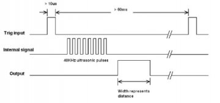
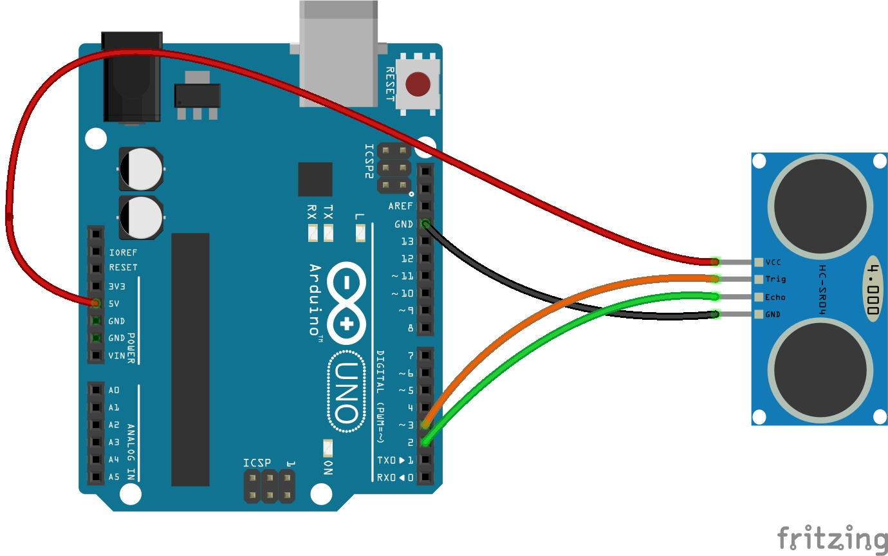
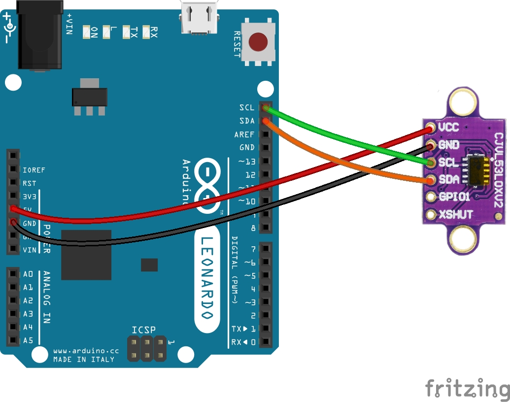

# Distance-measurement
Distance measurement with Arduino (HC-SR04 &amp; VL53L0X)

Presentation
======
In this Article, we will see two sensors to measure a distance from an obstacle with an Arduino board.
----------

hcsr04

l53l0x

The 2 sensors used:
<table style="border-collapse: collapse; width: 99.8%;" border="1">
<tbody>
<tr class="row_first">
<th id="idfe14_c0" style="width: 13.2%;">Sensor</th>
<th id="idfe14_c1" style="width: 39%;">technology</th>
<th id="idfe14_c2" style="width: 25.6%;">Scope</th>
<th id="idfe14_c3" style="width: 22%;">precision<//th>
</th>
</tr>
<tr class="row_odd odd">
<td headers="idfe14_c0" style="width: 13.2%;">HC-SR04</td>
<td headers="idfe14_c1" style="width: 39%;">onde ultra-son ("time of flight")</td>
<td headers="idfe14_c2" style="width: 25.6%;">2 cm &agrave; 400 cm</td>
<td headers="idfe14_c3" style="width: 22%;">1 cm approximately</td>
</tr>
<tr class="row_even even">
<td headers="idfe14_c0" style="width: 13.2%;">VL53L0x</td>
<td headers="idfe14_c1" style="width: 39%;">infrared laser light wave ("time of flight")</td>
<td headers="idfe14_c2" style="width: 25.6%;">5cm to 120cm (default mode)</td>
<td headers="idfe14_c3" style="width: 22%;">3% &agrave; 7% (en int&eacute;rieur)</td>
</tr>
</tbody>
</table>

## Characteristics of the HC-SR04 sensor

This sensor works on the principle of a sonar: The sensor emits an ultra-sound wave that will be reflected on an obstacle and we measure the time it takes to return to the sensor.


The sensor documentation indicates that: distance = 1/58 x duration = 0.172 x duration (distance in cm, duration ms)

CHECK: Knowing the speed of sound propagation in air C = 340 m / s approximately, we can deduce the distance:

    C = 2 x distance / duration therefore distance = 0.5 x C x duration (we take twice the distance because the wave travels the outward and return)
    therefore distance = 0.5 x 340 x duration = 170 x duration (distance in m, duration in s)
    If now, we express the duration in milliseconds (us) and the distance in centimeters (cm), we obtain: distance = 0.017 x duration (distance in cm, duration us), which corresponds roughly to the documentation.

Note: The speed of sound propagation in air depends on various parameters including temperature. There may therefore be fluctuations in measurements. https://en.wikipedia.org/wiki/Speed_of_sound

## The documentation for the HC SR04 provides the following chronograms:


To take a measurement, you must:

    send an impulse to the trigger pin (= trigger)
    the sensor emits a burst of ultrasonic waves
    the output pin goes to 1 for a period proportional to the distance

## HC-SR04 Sensor Connections :


## Code arduino: 

```cpp
int trig = 3 ;
int echo = 2 ;
long duree;
float distance ;

void setup() {
  pinMode(trig, OUTPUT );
  pinMode(echo, INPUT );
  Serial.begin(9600);
}

void loop() {
  // pulse of 10 us on the trig pin => triggering of the measurement
  digitalWrite(trig, 1 );
  delayMicroseconds(10);
  digitalWrite(trig, 0 );
 // read the duration of the high state of the pulse inus
  duree = pulseIn(echo, HIGH);
  distance = 0.017 * duration;
  Serial.print("distance in cm  : ");
  Serial.println(distance);
  delay(1000);
}
```

All that remains is to open the "serial monitor" to see the distance to the obstacle displayed.

The pulseIn () instruction is blocking. It does not allow you to move forward in the program until the falling edge of the pulse has appeared.
When we only want to read distances less than 1 m, i.e. a maximum pulse duration of the output pin of 5882 us, we will limit the pulse reading duration by adding a timeout to the pulseIn () instruction .
When the duration is greater than timeout, pulseIn () returns the value 0. In the following program, the distance is displayed only if it is less than 1 m (i.e. distance is different from 0)

Second code arduino : 

```cpp
int trig = 3;
    int echo = 2;
    long term;
    float distance;
     
    void setup () {
      pinMode (trig, OUTPUT);
      pinMode (echo, INPUT);
      Serial.begin (9600);
    }
     
    void loop () {
      // pulse of 10 us on the trig pin => triggering of the measurement
      digitalWrite (trig, 1);
      delayMicroseconds (10);
      digitalWrite (trig, 0);
      // read the duration of the pulse (max 5882)
      duration = pulseIn (echo, HIGH, 5882);
      distance = 0.017 * duration;
      if (distance) {
        Serial.print ("distance in cm:");
        Serial.println (distance);
      }
      delay (1000);
    }
```

## Characteristics of the VL53L0X sensor

    Sensor documentation: https://www.st.com/en/imaging-and-photonics-solutions/vl53l0x.html
    communication with the Arduino board via the I2c bus (SDA and SCL pins).
    digital output
    5V sensor supply (presence of a 3.3V regulator on the sensor board)

## VL53L0X sensor connections : 



Program

To implement it, I use Adafruit's BSD licensed library. https://github.com/adafruit/Adafruit_VL53L0X
This library can be installed from the library manager of the Arduino IDE (sketch -> include a library -> manage libraries)

```cpp
#include "Adafruit_VL53L0X.h"

Adafruit_VL53L0X capteur = Adafruit_VL53L0X();
VL53L0X_RangingMeasurementData_t mesure;

void setup() {
  Serial.begin(9600);

  // sensor initializationr
  if (!capteur.begin()) {
    Serial.println(F("Failed to connect to VL53L0X sensor"));
    while (1);
  }
}

void loop() {
  capteur.rangingTest(&mesure, false); // 'true' debugging info 
// Range Status = 4 means the measurement is wrong
  if (mesure.RangeStatus != 4) {   
    Serial.print("Distance in mm : ");
    Serial.println(mesure.RangeMilliMeter);
  }
  else {
    Serial.println(" wrong measurement  ");
  }
  delay(1000);
}
```
