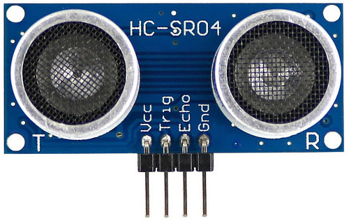
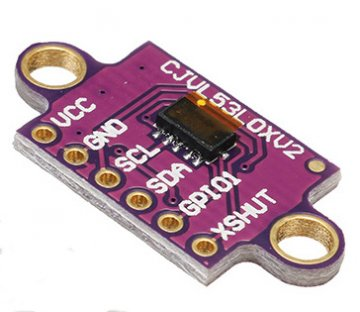
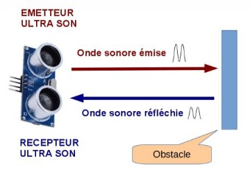

# Distance-measurement
Distance measurement with Arduino (HC-SR04 &amp; VL53L0X)

Presentation
======
In this Article, we will see two sensors to measure a distance from an obstacle with an Arduino board.
----------

hcsr04

l53l0x

The 2 sensors used:
<table style="border-collapse: collapse; width: 99.8%;" border="1">
<tbody>
<tr class="row_first">
<th id="idfe14_c0" style="width: 13.2%;">Sensor</th>
<th id="idfe14_c1" style="width: 39%;">technology</th>
<th id="idfe14_c2" style="width: 25.6%;">Scope</th>
<th id="idfe14_c3" style="width: 22%;">precision<//th>
</th>
</tr>
<tr class="row_odd odd">
<td headers="idfe14_c0" style="width: 13.2%;">HC-SR04</td>
<td headers="idfe14_c1" style="width: 39%;">onde ultra-son ("time of flight")</td>
<td headers="idfe14_c2" style="width: 25.6%;">2 cm &agrave; 400 cm</td>
<td headers="idfe14_c3" style="width: 22%;">1 cm approximately</td>
</tr>
<tr class="row_even even">
<td headers="idfe14_c0" style="width: 13.2%;">VL53L0x</td>
<td headers="idfe14_c1" style="width: 39%;">infrared laser light wave ("time of flight")</td>
<td headers="idfe14_c2" style="width: 25.6%;">5cm to 120cm (default mode)</td>
<td headers="idfe14_c3" style="width: 22%;">3% &agrave; 7% (en int&eacute;rieur)</td>
</tr>
</tbody>
</table>

## Characteristics of the HC-SR04 sensor

This sensor works on the principle of a sonar: The sensor emits an ultra-sound wave that will be reflected on an obstacle and we measure the time it takes to return to the sensor.

